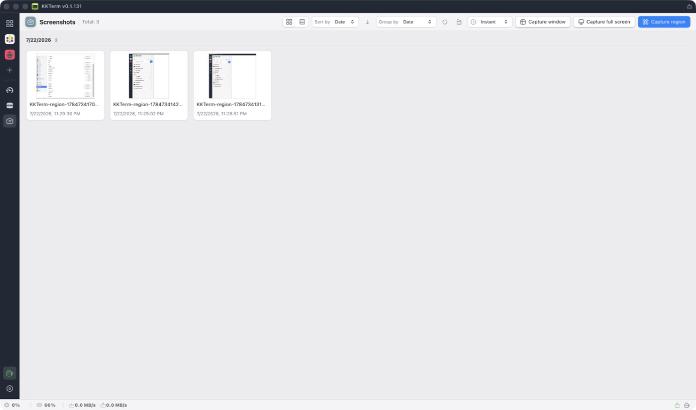

  

<h1 align="center">KKTerm</h1>

  <strong>หน้าต่างเนทีฟของ Windows หน้าต่างเดียวสำหรับเทอร์มินัล, SSH, SFTP, RDP/VNC และแดชบอร์ด — พร้อม AI ที่สร้างเครื่องมือเล็ก ๆ ของคุณเองได้ตามสั่ง</strong>

  <em>เพราะทาสก์บาร์ของคุณไม่ควรหน้าตาเหมือนตู้สล็อตที่ลาสเวกัส</em>

  ตั้งชื่อตาม <strong>乖乖 (Kuāi Kuāi / กวายกวาย)</strong> ขนมข้าวโพดสีเขียวรสมะพร้าวที่แอดมินระบบชาวไต้หวันวางไว้บนเซิร์ฟเวอร์เพื่อให้มันทำงานดี ๆ เราหวังว่าแอปนี้จะได้ที่ทางบนแร็คเช่นกัน

  <strong><a href="https://github.com/ryantsai/KKTerm/releases/latest">ดาวน์โหลด KKTerm รุ่นล่าสุด</a></strong>

  
  
  
  
  
   
  
  
   
  
    <a href="README.md">English</a> ·
    <a href="README.zh-TW.md">繁體中文</a> ·
    <a href="README.zh-CN.md">简体中文</a> ·
    <a href="README.ja.md">日本語</a> ·
    <a href="README.ko.md">한국어</a> ·
    <a href="README.fr.md">Français</a> ·
    <a href="README.de.md">Deutsch</a> ·
    <a href="README.es.md">Español</a> ·
    <a href="README.es-MX.md">Español (MX)</a> ·
    <a href="README.it.md">Italiano</a> ·
    <a href="README.pt-BR.md">Português (BR)</a> ·
    <strong>ไทย</strong> ·
    <a href="README.id.md">Bahasa Indonesia</a> ·
    <a href="README.vi.md">Tiếng Việt</a>
  

---

## พิตช์ใน 45 วินาที

KKTerm รวมเทอร์มินัลในเครื่อง, SSH/SFTP, FTP/FTPS, Telnet, serial, RDP/VNC, หน้าเว็บแบบฝัง, ไฟล์ในเครื่อง และเอกสารไว้ใน workspace เดสก์ท็อปเดียว Tab หนึ่งสามารถผสม Pane หลายชนิด เพื่อให้เทอร์มินัล เบราว์เซอร์ไฟล์ และหน้าจอระยะไกลของงานเดียวกันอยู่ด้วยกัน

ใช้งานได้บน Windows, macOS และ Linux โดยเก็บข้อมูลไว้ในเครื่องและไม่มี telemetry พร้อม AI ที่ต้องได้รับอนุมัติ, widget Dashboard ที่ปรับแต่งได้, Workspace, IT Ops และ Install Helper สำหรับ Windows

---

## ทำไมถึงชื่อ "KKTerm"?

เดินเข้าไปในดาต้าเซ็นเตอร์ไต้หวันที่ไหนก็ได้แล้วมองที่ด้านบนของแร็ค ผ่านโรงงาน TSMC, ห้องควบคุมรถไฟฟ้าไทเป, ห้องเซิร์ฟเวอร์ของธนาคาร Cathay, อุปกรณ์ชุมสายของ Chunghwa Telecom — คุณจะเห็นถุงเล็ก ๆ สีเขียวของ 乖乖 (Kuāi Kuāi) ขนมข้าวโพดรสมะพร้าวจากยุค 1960

**KKTerm** คือ **Kuai Kuai Term** — พื้นที่ทำงานแอดมินที่มุ่งหวังงานเดียวกับขนมชิ้นนั้น: นั่งเงียบ ๆ ข้างเครื่องสำคัญของคุณและช่วยให้มันทำงานดี ๆ โลคัลมาก่อน ไม่มี telemetry AI ต้องผ่านการอนุมัติ ซอฟต์แวร์ประเภทน่าเบื่อแต่ไว้ใจได้

เรายังไม่สามารถแถมถุง Kuai Kuai จริง ๆ ไปกับตัวติดตั้งได้ นั่นเป็นรายการของ v2

---

## ดูมันขยับ

  

<em>(GIF เดโม ภาพหนึ่งภาพมีค่ามากกว่าหัวข้อย่อยพันหัวข้อ และเราก็ใช้หัวข้อย่อยหมดแล้ว)</em>

---

## หน้าต่างเดียว ทุกการเชื่อมต่อ

| คุณอยากจะ… | KKTerm ทำได้ |
| --- | --- |
| เปิดเชลล์ในเครื่อง PowerShell / cmd / WSL | เทอร์มินัลในเครื่อง วางเรียงข้างกัน |
| SSH เข้าเซิร์ฟเวอร์ | SSH พร้อมคีย์ agent รหัสผ่าน jump host และ port forwarding |
| เรียกดูไฟล์บนเซิร์ฟเวอร์นั้น | SFTP จากการเชื่อมต่อ SSH — สองแผง ลากเพื่อถ่ายโอน |
| FTP ไปยัง NAS จากปี 2012 | FTP / FTPS ในเบราว์เซอร์ไฟล์เดียวกัน |
| Telnet ไปยังอุปกรณ์โบราณ | ใช่ Telnet ก็มีอยู่ในนั้น |
| คุยกับพอร์ตอนุกรม | การเชื่อมต่อ Serial — เลือกพอร์ต COM และ baud |
| รีโมตเข้าเครื่อง Windows | Microsoft Remote Desktop ของจริง ฝังมาในตัว |
| VNC เข้า Pi | VNC เรนเดอร์ลงในพื้นที่ทำงานโดยตรง |
| เปิดหน้าเว็บแอดมินของเราเตอร์ | แท็บเบราว์เซอร์ฝังในตัว พร้อมล็อกอินที่บันทึกไว้ |
| เรียกดูดิสก์ของตัวเอง | Pane File Explorer ในเครื่อง เปลือกสองแผงแบบเดียวกับ SFTP |
| เปิดล็อก, CSV, รูปภาพ หรือ PDF | ตัวดู Document ในตัว พร้อมโหมดล็อกแบบ tail-follow ของจริง |
| ดู CPU ของโฮสต์ | แถบสถานะแบบเรียลไทม์ และแดชบอร์ดที่คุณต่อยอดได้เอง |

แอปเดียวกัน หน้าต่างเดียวกัน คีย์ลัดเดียวกัน ธีมเดียวกัน ที่หวังว่าจะไม่ทำเอาตาเลือดตก

  

---

## ทำไมคนถึงเปิดมันค้างไว้ทั้งวัน

### ดาวน์โหลดเล็ก เปิดเร็วเหมือนสายฟ้า

KKTerm ถูกสร้างให้รู้สึกเหมือนยูทิลิตี ไม่ใช่แพลตฟอร์มทั้งก้อน บิลด์เดสก์ท็อปปัจจุบันมีขนาดต่ำกว่า 20 MB ติดตั้งไว และเปิดเร็วพอที่การเปิด workspace สำหรับแอดมินจะไม่รู้สึกเหมือนกำลังบูตระบบปฏิบัติการอีกตัว

### กริดหลาย Pane ผสมได้ตามงานจริง

หนึ่ง Tab สามารถมีกริดของ Pane ได้ และ Pane เหล่านั้นไม่จำเป็นต้องเป็นชนิดเดียวกัน วาง SSH ข้าง SFTP, วาง PowerShell ในเครื่องไว้ใต้ RDP Session, วาง VNC ข้าง Web UI ของเราเตอร์ หรือวางตัวจัดการไฟล์ข้างเทอร์มินัลที่กำลังย้ายไฟล์อยู่

  

### ผู้ช่วย AI ที่สั่งงานเทอร์มินัลให้คุณ

เดโม "AI ในเทอร์มินัล" ส่วนใหญ่หยุดอยู่แค่แชต ผู้ช่วยของ KKTerm ทำงาน *ข้างใน* เซสชันของคุณ: คุณยื่นบริบทจากสิ่งที่อยู่บนหน้าจออยู่แล้วให้มัน แล้วมันก็ลงมือกับเครื่องที่คุณเชื่อมต่ออยู่ — โดยมีมนุษย์อยู่ในลูปอนุมัติเสมอ

  

### แดชบอร์ดที่ไม่เสแสร้งว่าเป็น Grafana

Dashboard คือกริดของ widget ที่ลากและปรับขนาดได้ มันไม่ได้มีไว้สำหรับ observability ระดับเพตะไบต์ — มันมีไว้สำหรับ "ฉันอยากได้ปุ่มเปิดแอปโปรด 5 ตัว และแผงแสดง uptime ของโฮสต์ SSH ของฉัน *ข้าง ๆ* แชตของฉัน"

Dashboard View ใช้พื้นหลังเคลื่อนไหวที่มากับ KKTerm ได้ 45 แบบ โดย 8 แบบใหม่ล่าสุดเป็นฉาก WebGL ที่สร้างด้วยกระบวนการ ได้แก่ `heroGeometric`, `ditherPrismHero`, `webglLiquid`, `silkAurora`, `closingPlasma`, `animatedGradient`, `prismGradient` และ `liquidChrome` ตัวเลือกพื้นหลังชุดเดียวกันนี้ใช้ได้กับ Terminal Connection, Document viewer และมุมมองเจาะลึกของ IT Ops ด้วย ฉากที่ถูกซ่อนหรืออยู่นอกหน้าจอจะหยุดเรนเดอร์และคืนทรัพยากร WebGL

  

### IT Ops สำหรับไซต์ โฮสต์ และงานที่ทำซ้ำ

Module **IT Ops** จัดกลุ่ม Connection เป็น Site แสดง Server Room และ Rack จัดทำรายการ Host และเรียกใช้ Task ที่นำกลับมาใช้ได้บนเครื่องที่เลือก Batch Run เก็บผลลัพธ์แยกตาม Host ส่วน Automation เชื่อมทริกเกอร์และเงื่อนไขเข้ากับการแจ้งเตือน เว็บฮุก หรือ Task

  

### จับภาพ จัดระเบียบ และใส่คำอธิบายภาพหน้าจอ

Module **Screenshots** จับภาพพื้นที่ที่เลือก หน้าต่าง หรือเดสก์ท็อปทั้งหมดไปยังคลังในเครื่อง คลิปบอร์ด หรือทั้งสองที่ คุณสามารถเรียงและจัดกลุ่มภาพ ปรับขนาดหรือแปลงไฟล์หลายภาพพร้อมกัน และเปิดภาพใดก็ได้ในตัวแก้ไขที่มีเครื่องมือครอบตัด วาดด้วยมือ ลูกศร รูปร่าง ข้อความ และโมเสกสำหรับปิดบังข้อมูล ปุ่มลัดส่วนกลางและเมนูถาดระบบช่วยให้เริ่มจับภาพได้ในครั้งเดียว

  

### ทำให้เอเจนต์ AI ของคุณยังมีชีวิต

นี่คือฟีเจอร์ที่สองที่คนตกหลุมรัก เทอร์มินัล SSH ของ KKTerm สามารถส่งคุณเข้าไปใน **เซสชัน tmux ที่ตั้งชื่อไว้** บนโฮสต์รีโมตได้โดยตรง ซึ่งรอดจากการเชื่อมต่อใหม่.

  

### แยกโลกของคุณออกจากกันด้วย Workspaces

โฮมแล็บ งานประจำ และเซิร์ฟเวอร์ของลูกค้ารายนั้นไม่ควรอยู่ในรายการเดียวกัน **Workspaces** คือกล่อง Connection ที่ตั้งชื่อและแยกออกจากกัน ที่คุณสลับได้จาก Activity Rail การสลับจะจัดขอบเขตใหม่ให้เฉพาะทรีการเชื่อมต่อเท่านั้น — Sessions ที่เปิดอยู่ Dashboard และการตั้งค่าของคุณยังอยู่ที่เดิม — ดังนั้นการเปลี่ยนบริบทจึงใช้แค่คลิกเดียว ไม่ใช่การรีสตาร์ต

  

### แต่งให้ถูกใจ: ธีมสี

พื้นหลังคือส่วนสนุก ส่วน **ธีมสี** คือสิ่งที่คุณจ้องมองจริง ๆ ทั้งวัน KKTerm มาพร้อมชุดสี **ยี่สิบหกแบบ** ที่ปรับโฉมโครมทั้งแอป — Activity Rail, ทรีการเชื่อมต่อ, แท็บ, ไดอะล็อก — พร้อมตัวอย่างย่อแบบสดของแต่ละแบบใน ตั้งค่า ▸ ลักษณะ.

  

### Install Helper (เฉพาะ Windows)

การตั้งค่าเครื่อง Windows ใหม่เพื่อทำงาน dev มักหมายถึงสิบแท็บเบราว์เซอร์และ "ถัดไป ถัดไป เสร็จสิ้น" อีกเพียบ **Install Helper** คือแคตตาล็อกในตัวที่ค้นหา ติดตั้ง อัปเดต และถอนการติดตั้งเครื่องมือที่ไม่งั้นคุณต้องไล่หาด้วยมือ — โดยไม่ต้องออกจาก KKTerm.

  

---

## KKTerm ไม่ใช่อะไร

รายการสั้น ๆ เพราะความซื่อสัตย์สร้างความไว้วางใจ:

- **ไม่ใช่ผลิตภัณฑ์คลาวด์** ไม่มีซิงค์ ไม่มีบัญชีทีม ไม่มีแพ็กเกจ SaaS ถ้าวันไหนคุณเห็นไดอะล็อก "ลงชื่อเข้าใช้ KKTerm" แปลว่ามีบางอย่างผิดพลาดอย่างหายนะ
- **ไม่เสแสร้งว่าทุกระบบปฏิบัติการเหมือนกัน** KKTerm มีบิลด์สำหรับ Windows, macOS และ Linux แต่ยังบอกขอบเขตฟีเจอร์เฉพาะแพลตฟอร์มอย่างชัดเจน
- **ไม่ใช่เอเจนต์ AI อัตโนมัติ** ผู้ช่วยเสนอ มนุษย์ตัดสิน `Allow All` เป็นทางเลือกที่คุณเลือกเอง ไม่ใช่ค่าเริ่มต้น
- **ไม่ใช่ของทดแทน Grafana / Datadog** Dashboard มีไว้สำหรับหน้าควบคุมส่วนตัว ไม่ใช่ observability สำหรับโฮสต์หมื่นเครื่อง
- **ไม่ใช่ Kubernetes IDE** มันคือพื้นที่ทำงานแอดมินที่เน้นเทอร์มินัล กรุณาอย่าขอให้มันเรนเดอร์ Helm chart

ถ้าข้อใดข้อหนึ่ง *เคย* เป็นจุดตัดสินใจ — ก็ยุติธรรมดี เจอกันใน v2

---

## รับ KKTerm

**[ดาวน์โหลด KKTerm รุ่นล่าสุด](https://github.com/ryantsai/KKTerm/releases/latest)** เลือกแพ็กเกจสำหรับแพลตฟอร์มของคุณ แล้วเปิดใช้งาน ตัวติดตั้ง Windows ตอนนี้ **ยังไม่ได้เซ็น** — การเซ็นรีลีสอยู่ในโรดแมป ดังนั้นจนกว่าจะถึงตอนนั้น แอนติไวรัสของคุณอาจมองคุณด้วยสายตาเข้มงวด นั่นเป็นเรื่องปกติ

อยากบิลด์จากซอร์สหรือมีส่วนร่วม? ทุกอย่างที่คุณต้องการอยู่ใน [`CONTRIBUTING.md`](CONTRIBUTING.md)

---

## โรดแมป (ฉบับสั้น)

- ขัดเกลารีลีสข้ามแพลตฟอร์ม
- ขัดเกลาการเซ็นรีลีส
- การถ่ายโอนไฟล์ที่ทรงพลังขึ้น (รับโอนต่อ, ซิงค์โฟลเดอร์, บีบอัด/แตกไฟล์)
- การแชร์คลิปบอร์ดและอุปกรณ์ของ Remote Desktop ที่สมบูรณ์ขึ้น
- widget แดชบอร์ดในตัวเพิ่มขึ้น
- ฟังก์ชันอัตโนมัติของ IT Ops เพิ่มขึ้น

ฉบับเต็มและอัปเดตบ่อย: [`docs/ROADMAP.md`](docs/ROADMAP.md)

---

## มีส่วนร่วม

เรายินดีมากถ้ามีคนช่วย จริง ๆ แม้แต่เรื่องเล็ก ๆ ก็มีความหมาย.

การตั้งค่าครบถ้วน โครงสร้างโปรเจกต์ และเช็กลิสต์ PR อยู่ใน [`CONTRIBUTING.md`](CONTRIBUTING.md) หาจุดเริ่มต้นอยู่หรือ? กรอง issue ที่เปิดอยู่ด้วย [`good first issue`](https://github.com/ryantsai/KKTerm/issues?q=is%3Aissue+is%3Aopen+label%3A%22good+first+issue%22) หรือ [`help wanted`](https://github.com/ryantsai/KKTerm/issues?q=is%3Aissue+is%3Aopen+label%3A%22help+wanted%22)

---

## เอกสารโปรเจกต์

- [บริบทผลิตภัณฑ์](CONTEXT.md) — ภาษาเฉพาะโดเมนที่คุณควรยึดตาม
- [สถาปัตยกรรม](docs/ARCHITECTURE.md) — แผนที่โมดูล ที่ที่ควรวางโค้ดใหม่
- [คู่มือผู้ใช้](docs/manual/INDEX.md) — เดินดูทีละฟีเจอร์
- [โรดแมป](docs/ROADMAP.md)
- [สถาปัตยกรรม Dashboard](docs/DASHBOARD.md)
- [เซิร์ฟเวอร์ MCP ในตัว](docs/MCP.md)
- [คู่มือผู้ให้บริการ AI](docs/AI_PROVIDERS.md)

---

## สัญญาอนุญาต

MIT ดู [LICENSE](LICENSE) ใช้มัน fork มัน ส่งมันออกไป เอามันไปไว้ในโฮมแล็บที่ไม่มีใครหาเจอ — นั่นแหละข้อตกลง
